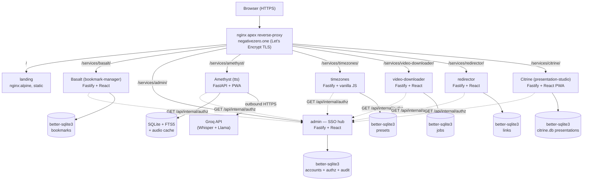
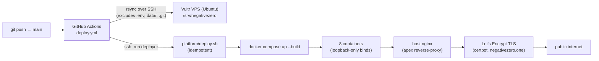

# Architecture

Full technical architecture of the negativezero platform. Update this
when the architecture meaningfully changes — new component, replaced
dependency, storage model change, deployment target shift. Not a daily
file.

This doc is the static map — what exists and where: services, stacks,
the URL/repo layout, data stores, the component map, and the deployment
topology. The dynamic narrative (request lifecycle, the SSO/auth state
machine end to end) lives in `docs/SYSTEM_DESIGN.md`.

For day-to-day status and what's being worked on, see `PLAN.md`. For the
reasoning behind architectural choices, see `DECISIONS.md`.

The platform is eight services behind one nginx apex: a static landing
page plus seven path-mounted services (Basalt, admin, Amethyst,
timezones, video-downloader, redirector, Citrine). Admin is the SSO hub;
every gated service shares one `nz_session` cookie and asks admin for
per-account authorization.

---

## Stack

- **Landing:** static HTML/CSS/Canvas (apps/landing/). Hypotrochoid
  animation in vanilla JS. No build step.
- **Timezones:** vanilla HTML/CSS/JS client (apps/timezones/public/) served
  by a small Node 22 + Fastify backend (apps/timezones/server/). Timezone math
  stays client-side via the `Intl` API; the backend gates the service on the
  apex SSO cookie + admin authz and stores per-account presets in SQLite
  (SSO-cookie-only — no local login of its own).
- **Bookmark service backend (Basalt):** Node 22 + Fastify 5 + TypeScript +
  better-sqlite3 12. SQLite file lives on the VPS via a bind-mount
  volume. Mounted at `/services/basalt/`. Auth is the shared apex SSO
  cookie + admin authz, with a local WebAuthn + setup-code fallback.
- **Bookmark service frontend:** React 18 + Vite 8 + Tailwind 4.
- **Admin backend (SSO hub):** Node 22 + Fastify 5 + TypeScript +
  better-sqlite3 12. Same shape as Basalt, separate state. Owns the
  `accounts` table, mints the apex `nz_session` cookie on passkey login,
  and answers per-account, per-service authorization at
  `/api/internal/authz`. Also the passkey-protected registration-code
  generator. Future: per-service settings UI (e.g., cleanup/proofread
  prompts for tts).
- **Admin frontend:** React 18 + Vite 8 + Tailwind 4.
- **TTS service:** Python 3.12 + FastAPI + uvicorn + aiosqlite (with
  FTS5). Whisper transcription via Groq, LLM cleanup / proofreading
  via Groq Llama. PWA frontend is vanilla HTML/JS (no framework).
  Imported as-is from the upstream amethyst project; see
  DECISIONS.md 2026-05-28 entries on the absorption and the
  Python+FastAPI exception to the TS+Fastify convention.
- **Citrine service:** Node 22 + Fastify 5 + TypeScript + better-sqlite3
  12 backend and a React 18 + Vite 8 + Tailwind 4 PWA frontend.
  Web-native presentation editor mounted at `/services/citrine/`.
  Presentations are persisted server-side in `citrine.db` (owner-scoped
  CRUD), it serves the imported Claude Design source behind auth, and
  validates JSON documents/exports on the backend. Auth is the shared
  SSO cookie with a local passkey fallback.
- **Video-downloader service:** Node 22 + Fastify 5 + TypeScript +
  better-sqlite3 12 backend and a React 18 + Vite 8 + Tailwind 4 SPA
  frontend. Clear-HLS remux tool mounted at `/services/video-downloader/`:
  accepts a public `.m3u8` URL, downloads segments, and remuxes to
  `.mov`/`.mp4` with ffmpeg stream copy. Shared SSO cookie + local
  passkey fallback; per-account job state in SQLite.
- **Redirector service:** Node 22 + Fastify 5 + TypeScript +
  better-sqlite3 12 backend and a React 18 + Vite 8 + Tailwind 4 SPA
  frontend. Short-link service mounted at `/services/redirector/`: the
  owner pastes a destination and gets a permanent 16-char hash that
  302-redirects publicly. Management UI behind the shared SSO cookie +
  local passkey fallback; the `<hash>` endpoint is public. Links in
  SQLite; no at-rest encryption, no outbound fetch.
- **Reverse proxy:** nginx on the host (shared with unrelated tenants).
  Containers bind to 127.0.0.1 only; nginx is the public entry point.
- **TLS:** Let's Encrypt via certbot, one cert on the apex
  (`negativezero.one`).
- **Containerization:** Docker + Docker Compose v2.
- **Host:** Vultr VPS, Ubuntu. Shared with unrelated tenants (wellfit,
  isgroup-one); this project's containers + nginx files coexist
  without touching their configs.

---

## Component map

nginx is the only public entry point. It reverse-proxies the apex `/`
to the static landing container and strips the `/services/<name>/`
prefix for each path-mounted service. Every container binds to
`127.0.0.1` only. Admin is the SSO hub: it mints the apex `nz_session`
cookie and answers per-account authorization checks at
`GET /api/internal/authz` (internal docker-network only; nginx 404s
`/services/admin/api/internal/`). Each TypeScript service owns its own
better-sqlite3 DB; tts owns a FastAPI + SQLite (FTS5) store; landing is
static.



Loopback binds and the internal authz fan-out are static facts about
where things live; the step-by-step cookie/authz request lifecycle is
documented in `docs/SYSTEM_DESIGN.md`.

---

## Repository layout

```
apps/
  landing/              static landing page (negativezero.one/)
  bookmark-manager/     Basalt bookmark service (negativezero.one/services/basalt/)
  admin/                SSO hub + registration-code generator (negativezero.one/services/admin/)
  tts/                  whisper + LLM cleanup pipeline (negativezero.one/services/amethyst/)
  timezones/            gated cross-timezone planner (negativezero.one/services/timezones/)
  video-downloader/     clear-HLS remux tool (negativezero.one/services/video-downloader/)
  redirector/           short-link redirects (negativezero.one/services/redirector/)
  presentation-studio/  Citrine web-native presentation editor (negativezero.one/services/citrine/)
platform/
  docker-compose.yml    orchestrates landing + bookmark-manager + admin + tts + timezones + video-downloader + redirector + citrine
  deploy.sh             idempotent deployer for the VPS
  nginx/                apex site config + shared connection_upgrade map
  .env.template         starting point for the deployed .env
docs/
  CLAUDE.md             entry point for Claude Code
  ARCHITECTURE.md       (this file)
  PLAN.md               active to-do
  DECISIONS.md          append-only decision log
  RUNBOOK.md            operator procedures
HANDOVER.md             current deployed state + ops procedures (no secrets)
AGENTS.md               contract for LLM coding agents (Claude, Cursor, Aider)
TODO.md                 granular session-actionable task list
```

Add a new service by creating `apps/<name>/`, adding a service block in
`platform/docker-compose.yml`, and adding an nginx location block in
`platform/nginx/negativezero.one.conf`. The deploy script is structured
to absorb new services without changes.

---

## Components

**`apps/landing/`** — pure static site. One `index.html`, three Geist
font files. Served by an `nginx:alpine` container; the host nginx
reverse-proxies `/` to it. No build, no JS framework, no runtime
dependencies. Canvas animation is vanilla JS with `prefers-reduced-motion`
respected.

**`apps/bookmark-manager/`** — Basalt, the self-hosted bookmark service
(formerly the `url-vault` repo; mounted at `/services/basalt/`, container
+ data dir keep the `bookmark-manager` name). Fastify backend + React SPA
in one Docker image. Owns: bookmark CRUD, folders, JSON import/export,
server-side title/favicon fetching (SSRF-guarded), at-rest AES-256-GCM
encryption of bookmark names/URLs, full-text search. Auth is the shared
apex SSO cookie plus admin authz, with its own WebAuthn (passkey) +
setup-code flow as the local fallback. State is one SQLite file on a
bind-mount volume.

**`apps/admin/`** — platform-level admin tool and the **SSO hub**.
Fastify + React, same shape as Basalt. Owns the `accounts` table, mints
the apex `nz_session` cookie on passkey login, and answers per-account,
per-service authorization at `GET /api/internal/authz` (internal
docker-network only — nginx 404s the public path). It's also the
passkey-protected registration-code generator: the operator generates a
setup key for a service, shares it with a new account, the account
registers a passkey with it, and the operator toggles each account's
per-service access. The gated service list lives in
`apps/admin/server/src/lib/accounts.ts`. Future expansion: per-service
settings UI (e.g., editing the LLM cleanup and proofread system prompts
that tts uses).

**`apps/tts/`** — Whisper transcription + LLM cleanup/proofreading
pipeline. FastAPI backend, vanilla-JS PWA frontend, one container.
Owns: audio upload + retention purge, Groq Whisper transcription,
glossary-aware LLM cleanup, "polish" mode for stronger proofreading,
per-recording metadata + FTS5 search. Auth is a single Bearer API key
(operator-provisioned, used by the iPhone Shortcut + PWA). State is
one SQLite file plus an audio cache directory on a bind-mount volume.

**`apps/timezones/`** — gated cross-timezone meeting planner. A small
Fastify backend verifies the apex SSO cookie + admin authz and stores
per-account presets in SQLite; the vanilla client still does timezone
math with `Intl` in the browser. The service has no local passkey
fallback of its own (SSO-cookie-only).

**`apps/video-downloader/`** — passkey-protected clear-HLS remux tool.
Fastify backend + React SPA in one Docker image. Owns: accepting a
direct public clear-HLS `.m3u8` URL, downloading segments to a temp dir,
and remuxing to `.mov`/`.mp4` with ffmpeg stream copy (no decrypt, no
player scraping). Guarded by segment/byte/concurrency/timeout limits.
Auth is the shared SSO cookie + admin authz, with a local passkey +
setup-code fallback. State is one SQLite file on a bind-mount volume.

**`apps/redirector/`** — passkey-protected short-link service. Fastify
backend + React SPA in one Docker image. Owns: minting a permanent
16-char hash for a pasted destination URL and 302-redirecting the public
`<hash>` endpoint to it. The management UI is behind the shared SSO
cookie + admin authz (with a local passkey + setup-code fallback); the
`<hash>` redirect is public. No at-rest encryption and no outbound fetch
(the server only emits a `Location` header). State is one SQLite file on
a bind-mount volume.

**`apps/presentation-studio/`** — Citrine, a private web-native
presentation editor. Fastify backend + React SPA in one Docker image.
Owns: shared SSO cookie + admin authz with a local passkey fallback,
authenticated serving of the imported `ISG Studio.html` Claude Design
source, JSON document validation, PWA app shell, freeform canvas,
premade element registry, preview mode, and JSON import/export.
Presentations are persisted **server-side** in `citrine.db` (one
better-sqlite3 file on a bind-mount volume) via owner-scoped CRUD —
keyed on `'owner'` for the local passkey or on the SSO account id.

**`platform/`** — orchestration. `docker-compose.yml` defines landing
+ bookmark-manager + admin + tts + timezones + video-downloader +
redirector + citrine. `deploy.sh` is the idempotent VPS
deployer (generates secrets, picks free ports, pulls/builds images,
installs nginx site files, runs certbot). `nginx/` holds the apex
site config + the shared `$connection_upgrade` map.

---

## URL layout

Everything lives under the apex with path-mount routing. nginx strips
the `/services/<name>/` prefix before proxying, so each container sees
clean root paths.

```
negativezero.one/                              → static landing (apps/landing)
negativezero.one/services/basalt/              → Basalt (bookmark) SPA
negativezero.one/services/basalt/api/...       → Basalt API
negativezero.one/services/bookmark-manager/    → 308 redirect → /services/basalt/ (old URL)
negativezero.one/services/admin/               → admin SPA + API (SSO hub)
negativezero.one/services/admin/api/internal/  → 404 (internal authz; sibling containers only)
negativezero.one/services/amethyst/                 → tts PWA + API
negativezero.one/services/amethyst/api/v1/...       → tts API (Bearer or SSO cookie)
negativezero.one/services/timezones/           → gated timezone planner (client + API)
negativezero.one/services/video-downloader/    → video-downloader SPA + API
negativezero.one/services/redirector/          → redirector SPA + API
negativezero.one/services/redirector/<hash>    → public 302 redirect (16-char hash)
negativezero.one/services/citrine/             → Citrine presentation editor SPA + API
negativezero.one/vtt-transcriber/              → 308 redirect → /services/amethyst/
                                                  (legacy URL kept for old clients)
negativezero.one/services/<future>/            → future services (add a location block)
```

**Path-mount on services:** nginx strips the `/services/<name>/` prefix
before proxying to the upstream container. Both the `location` directive
and the `proxy_pass` target end in `/`, which makes nginx rewrite the
matched prefix to `/` for the upstream. For the SPA-bearing services
(Basalt, admin, video-downloader, redirector, citrine), Vite's `base`
config bakes the prefix back into asset references in the bundle. For
tts and the timezones client, the frontend uses relative URLs, so no
client-side base config is needed.

---

## Communication

- **Browser → nginx:** HTTPS (Let's Encrypt cert on `negativezero.one`).
- **nginx → landing container:** loopback HTTP on `LANDING_HOST_PORT`.
- **nginx → bookmark-manager (Basalt):** loopback HTTP on `BOOKMARK_HOST_PORT`.
- **nginx → admin:** loopback HTTP on `ADMIN_HOST_PORT`.
- **nginx → tts (Amethyst):** loopback HTTP on `TTS_HOST_PORT`.
- **nginx → timezones:** loopback HTTP on `TIMEZONES_HOST_PORT`.
- **nginx → video-downloader:** loopback HTTP on `VIDEO_DOWNLOADER_HOST_PORT`.
- **nginx → redirector:** loopback HTTP on `REDIRECTOR_HOST_PORT`.
- **nginx → citrine:** loopback HTTP on `CITRINE_HOST_PORT`.
- **Browser ↔ gated services:** HTTPS with the shared apex `nz_session`
  SSO cookie (HS256, signed with `SSO_SESSION_SECRET`); each service also
  keeps its own `@fastify/secure-session` for its local passkey fallback.
- **Gated service → admin (internal):** loopback within the docker
  `negativezero-internal` network, `GET http://admin:3000/api/internal/authz`
  for per-account, per-service authorization (cached ~30s). Never
  reachable from the public internet.
- **iPhone Shortcut ↔ tts:** HTTPS, `Authorization: Bearer
  <TTS_API_KEY>` on every `/api/v1/...` request (the Amethyst PWA itself
  now rides the SSO cookie).
- **tts → Groq (outbound):** HTTPS to the Groq API for Whisper
  transcription and Llama-based cleanup/proofreading.

---

## Data stores

Each service owns its own data store under `platform/data/<service>/`,
bind-mounted into the container. There is no shared database. Backup is
a directory-tree snapshot. The step-by-step read/write and auth request
lifecycle for each service lives in `docs/SYSTEM_DESIGN.md`; this is the
static "what is persisted, and where" map.

| Service | Store | Owns |
| --- | --- | --- |
| landing | — | Static files only; no persistence. |
| Basalt (bookmark-manager) | better-sqlite3 (WAL) | Bookmarks, folders, FTS index; names/URLs AES-256-GCM-encrypted with `BOOKMARK_ENCRYPTION_KEY`. Local passkey credentials. |
| admin (SSO hub) | better-sqlite3 (WAL) | `accounts` table, per-service authorization, registration/setup codes, audit log, admin passkey credentials. |
| Amethyst (tts) | SQLite + FTS5 (`amethyst.sqlite`) + `audio/` | Recording metadata + transcripts (FTS5-indexed); cached audio kept for `AUDIO_RETENTION_DAYS` (default 90). |
| timezones | better-sqlite3 (WAL) | Per-account meeting/timezone presets. No local credentials (SSO-cookie-only). |
| video-downloader | better-sqlite3 (WAL) | Remux job state. Local passkey credentials. |
| redirector | better-sqlite3 (WAL) | Short-link `<hash>` → destination map. Local passkey credentials. No at-rest encryption. |
| Citrine (presentation-studio) | better-sqlite3 (WAL, `citrine.db`) | Owner-scoped saved presentations (`presentations` table). Local passkey credentials. |

The tts pipeline additionally calls Groq (Whisper transcription + Llama
cleanup, with an optional stronger-model "polish" pass); Groq is the
only outbound third-party dependency in any request path.

---

## External dependencies

- **Vultr VPS** — single host. Hard dependency. Outage = everything
  goes down. No HA fallback at this scale.
- **Groq** — Whisper and Llama inference for tts. Hard dependency for
  the tts service only; every other service works without it.
  Rate-limited per the Groq account tier.
- **Let's Encrypt** — TLS certs. Soft dependency at request time;
  certbot renews automatically every 60 days.
- **WebAuthn platform authenticators** (iCloud Keychain, Touch ID,
  Windows Hello) — passkey storage on user devices for admin and the
  gated services' local fallback. If a user loses all passkey-storing
  devices, the backup code is the recovery path.
- **No third-party APIs in the Basalt request path** — the bookmark
  fetcher reaches arbitrary URLs to grab titles/favicons but those are
  user-initiated and SSRF-guarded. video-downloader fetches the
  user-supplied `.m3u8` and its segments; redirector makes no outbound
  request at all.

---

## Key design decisions baked into the structure

Detailed reasoning lives in `DECISIONS.md`; this is the one-line
pointer list. Earlier decisions about Logto, Neon, and a separate
auth subdomain were reversed on 2026-05-28 — see the top of
DECISIONS.md.

- **Monorepo with apps/ + platform/ + docs/ layout.** Scales by
  adding directories, not restructuring. See DECISIONS.md 2026-05-21.
- **Path-mount everything under the apex.** No subdomain per service;
  one TLS cert, one DNS A record, one nginx site file. See
  DECISIONS.md 2026-05-21 (still in force; the Logto subdomain
  exception was removed when Logto was removed).
- **No third-party identity provider (no Logto/OIDC).** Auth is built
  in-house on WebAuthn passkeys + setup codes. Simpler than running an
  OIDC server at this scale. Originally each service owned an isolated
  passkey flow; this was later centralized under admin as the SSO hub
  (see the next bullet). See DECISIONS.md 2026-05-28 "Logto removed from
  the platform".
- **Multi-account + per-service authorization (admin-owned).** The
  single-owner model was extended (2026-06-18) so the owner can invite
  friends via admin-generated setup keys and toggle each account's
  access per service. Admin owns the `accounts` table and is the SSO
  hub; the `nz_session` cookie carries the account id; gated services
  verify the cookie then ask admin `GET /api/internal/authz` (cached
  ~30s) whether the account may use that service. Amethyst's PWA dropped
  its API-key field in favour of this (the iPhone Shortcut Bearer key
  stays). See DECISIONS.md 2026-06-18.
- **Python + FastAPI exception for tts.** Net-new services still
  default to TS + Fastify; tts is the documented exception because
  rewriting a working imported service would burn weeks for no
  functional gain. See DECISIONS.md 2026-05-28.
- **Landing is one HTML file.** No build, no framework. Three fonts +
  ~80 lines of canvas JS. Anything more would be lifestyle, not need.
- **Per-service SQLite, bind-mounted.** Every persistent service (Basalt,
  admin, tts, timezones, video-downloader, redirector, Citrine) owns its
  own SQLite file under `platform/data/<service>/`. No shared database.
  Backup = snapshot a directory tree. See DECISIONS.md 2026-05-21.
- **Single server-side `ENCRYPTION_KEY` for bookmark data.** Server
  can decrypt all bookmarks. Accepted vs E2E because (a) it's
  single-tenant today, (b) "see my bookmarks across devices" requires
  it. See DECISIONS.md 2026-05-21.

---

## Deployment topology

A push to `main` triggers `.github/workflows/deploy.yml`: the runner
checks out main, rsyncs the tree to the VPS over SSH (excluding
`.git/`, `node_modules/`, `dist/`, `platform/.env*`, and
`platform/data/`), then runs `platform/deploy.sh` on the box. The VPS
has no GitHub credentials, so the runner pushes rather than the box
pulling. `deploy.sh` brings up all eight services via `docker compose`
behind the host nginx, which terminates Let's Encrypt TLS on the apex.



```
Vultr VPS (Ubuntu)
│
├── nginx (system package, shared with other tenants)
│   ├── sites-available/negativezero.one          (apex: landing + /services/*)
│   ├── conf.d/negativezero-connection-upgrade.conf  (WebSocket upgrade map)
│   └── (other tenants' configs — untouched)
│
├── /srv/negativezero/  (deploy root — this repo, checked out on the VPS)
│   ├── platform/
│   │   ├── docker-compose.yml
│   │   ├── deploy.sh
│   │   ├── .env             (secrets — gitignored, generated on first deploy)
│   │   └── data/
│   │       ├── bookmark-manager/  (Basalt; SQLite + WAL, bind-mounted)
│   │       ├── admin/             (SQLite + WAL, bind-mounted)
│   │       ├── tts/               (SQLite + WAL + audio/ cache, bind-mounted)
│   │       ├── timezones/         (SQLite + WAL, bind-mounted)
│   │       ├── video-downloader/  (SQLite + WAL, bind-mounted)
│   │       ├── redirector/        (SQLite + WAL, bind-mounted)
│   │       └── citrine/           (citrine.db + WAL, bind-mounted)
│   ├── apps/landing/             (bind-mounted into nginx-alpine container)
│   ├── apps/bookmark-manager/    (built into image at deploy time)
│   ├── apps/admin/               (built into image at deploy time)
│   ├── apps/tts/                 (built into image at deploy time)
│   ├── apps/timezones/           (built into image at deploy time)
│   ├── apps/video-downloader/    (built into image at deploy time)
│   ├── apps/redirector/          (built into image at deploy time)
│   └── apps/presentation-studio/ (Citrine; built into image at deploy time)
│
└── containers (all bind 127.0.0.1 only):
    ├── negativezero-landing            (nginx:alpine serving apps/landing/)
    ├── negativezero-bookmark-manager   (Basalt; Fastify + built React, SQLite on volume)
    ├── negativezero-admin              (SSO hub; Fastify + built React, SQLite on volume)
    ├── negativezero-tts                (Amethyst; FastAPI + PWA, SQLite + audio on volume)
    ├── negativezero-timezones          (Fastify + vanilla JS, SQLite on volume)
    ├── negativezero-video-downloader   (Fastify + built React, SQLite on volume)
    ├── negativezero-redirector         (Fastify + built React, SQLite on volume)
    └── negativezero-citrine            (Fastify + built React PWA, citrine.db on volume)
```

Deploy flow (idempotent): `platform/deploy.sh` ensures `.env` exists
(generates per-service secrets + a fresh `TTS_API_KEY` on first run;
operator pastes `GROQ_API_KEY` separately), picks free loopback ports,
runs `docker compose up --build`, installs a `negativezero-compose`
systemd unit for boot survival, installs nginx site files (substituting
the actual loopback ports), runs `nginx -t`, reloads, then certbot for
TLS. Re-runnable any time; preserves all `.env` secrets across re-runs.
