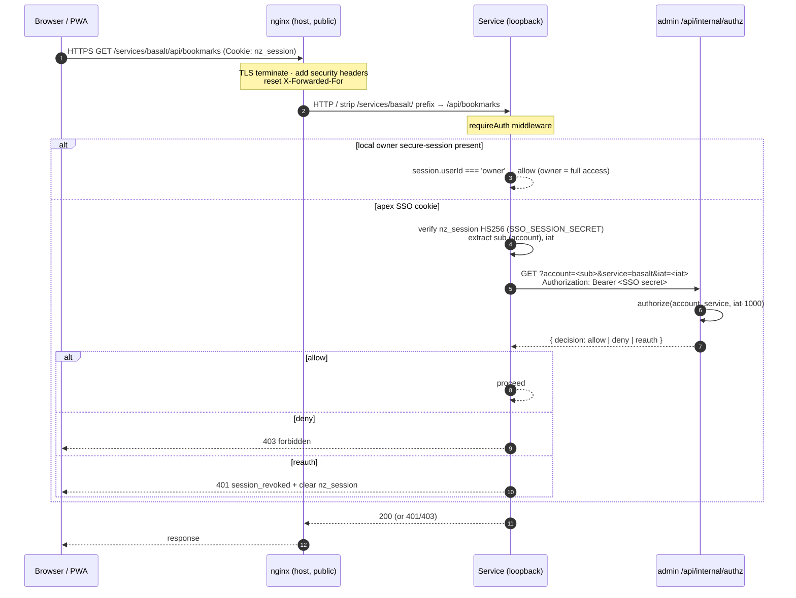
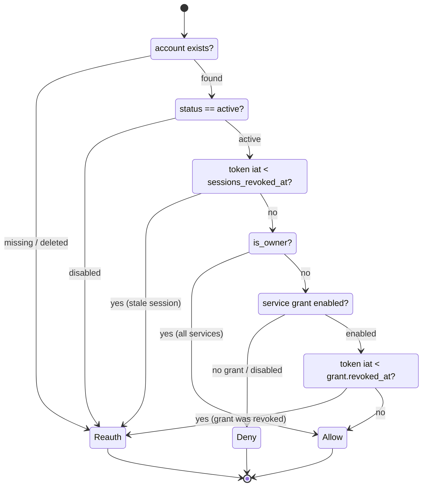

# System Design

Cross-cutting **dynamic** design of the negativezero platform: how a
request moves through the system, how authentication and authorization
are decided at runtime, where data lives and how it's protected, and
where the design breaks under load. This is the behaviour-over-time
companion to [`ARCHITECTURE.md`](./ARCHITECTURE.md), which maps the
static structure (stack, components, URL layout, deployment topology).

Read `ARCHITECTURE.md` first for the component map. Update this file
when the runtime behaviour meaningfully changes — a new auth mode, a
change to the authorization decision, a new persistence engine, or a
shift in the failure/scaling envelope. Not a daily file.

Sibling design docs (DESIGN_SYSTEM for visual/UI conventions, TECH_DEBT
for known shortcuts, TESTING_STRATEGY for the test pyramid) are
referenced in prose where relevant; the load-bearing source paths are
cited inline as code.

---

## Big picture

negativezero is a **single-VPS, single-process-per-service** platform.
There is exactly one public ingress (nginx on the host); every
application container binds to `127.0.0.1` only and is reachable solely
through nginx or over the private Docker network. Services are
independent — each owns its own SQLite file and its own process — but
they share **one identity fabric**: an apex-wide SSO cookie minted by
the `admin` service, and a single internal authorization endpoint that
`admin` exposes to its siblings.

The three runtime invariants that everything below rests on:

1. **nginx is the only thing on the public internet.** All app
   containers are loopback-bound; the internal authz endpoint is
   additionally 404'd at the edge.
2. **Authentication is local to a request; authorization is live.**
   A valid signature proves *who* you are; whether you may use *this
   service right now* is decided per-request by `admin`, with no
   positive caching.
3. **Fail closed.** Every gate — SSO verify, authz fetch, encryption,
   outbound fetch — denies or errors safe when its dependency is
   missing or unreachable.

---

## Request lifecycle

A browser request to a gated service crosses four trust hops: the
public edge (nginx), the service process, the SSO token check, and the
live authorization decision at `admin`.

1. **Browser → nginx (TLS).** HTTPS terminates at the host nginx
   (Let's Encrypt cert on the apex). Security response headers (HSTS,
   `X-Content-Type-Options`, `X-Frame-Options`, `Referrer-Policy`) are
   added on every response. See `platform/nginx/negativezero.one.conf`.
2. **nginx → service (loopback).** nginx matches the
   `/services/<name>/` location and proxies to the service's
   `127.0.0.1:<port>` upstream. The **trailing slash on both the
   `location` and the `proxy_pass`** strips the prefix, so the
   container sees clean root paths (`/api/...`). `X-Forwarded-For` is
   **reset** to the direct client (not appended), so an inbound spoofed
   header can't poison what upstreams see.
3. **Service → auth gate.** The service's `requireAuth` middleware runs
   before any protected handler. It first checks the service's own
   `@fastify/secure-session` cookie (the local-passkey owner path); if
   that's absent it reads the apex `nz_session` cookie, verifies the
   HS256 JWT signature with the shared `SSO_SESSION_SECRET`, and
   extracts `sub` (account id) + `iat` (issued-at). See
   `apps/bookmark-manager/server/src/middleware/auth.ts` and
   `apps/presentation-studio/server/src/middleware/auth.ts`.
4. **Service → admin authz (internal network).** With a valid SSO
   token, the service asks `admin` over the private Docker network
   (`http://admin:3000/api/internal/authz`), bearer-guarded by the
   shared SSO secret, whether this account may use this service. The
   response is `allow` / `deny` / `reauth`. See
   `apps/bookmark-manager/server/src/lib/authz.ts`.
5. **Decision applied.** `allow` → handler runs. `deny` → `403
   forbidden`. `reauth` → the dead `nz_session` cookie is cleared and
   the client gets `401 session_revoked` so it logs in again.

For the `tts` service the same shape applies but the client is usually
a machine (iPhone Shortcut) presenting a Bearer token rather than a
cookie; see the auth-modes table below and Amethyst's `backend/app/auth.py`
(now in the `amethyst-independent` repo, `web/`, not in this repo).

---

## Three authentication modes

The platform deliberately runs **three** ways to prove identity. They
share one signing secret (`SSO_SESSION_SECRET`) for the JWT-based modes
so Node (`jose`) and Python (PyJWT) verify byte-for-byte, but they
differ in who issues them, what they carry, and how revocation works.

| # | Mode | Who uses it | Credential | Issued by | Carries | Revocation |
|---|------|-------------|------------|-----------|---------|------------|
| 1 | **WebAuthn passkey (local)** | The owner, signing in directly on one service | `@fastify/secure-session` cookie scoped to that service, set after a WebAuthn assertion + one-time setup code | The service itself | `userId: 'owner'` | Clear the cookie / rotate `SESSION_SECRET`. Owner = full access, no authz call. |
| 2 | **SSO `nz_session` JWT** | Any account (owner or invited friend) in a browser, across all services | Apex-wide HS256 JWT cookie, `Path=/`, `HttpOnly`, `SameSite=Lax`, `Secure` in prod, 30-day max age | `admin` on passkey login | `sub` (account id), `name`, `iat` | Live, per-request, via `admin` authz (see state machine). |
| 3 | **Bearer API key / token** | Machine clients for `tts` (iPhone Shortcut) | `Authorization: Bearer …` header | Legacy single owner key from `.env`; or admin-minted per-account JWT (`scope: "api"`, `svc: "tts"`, with a `jti`) | Owner key: nothing. Token: `sub`, `iat`, `jti` | Owner key: rotate the env value. Token: revoke the `jti` row in `admin` (effective immediately). |

**When each applies, in order of precedence inside a service:**

- **Mode 1 wins if present.** Every `requireAuth` first checks
  `req.session.get('userId') === 'owner'`. A direct local passkey login
  owns a single `'owner'` space and short-circuits before any network
  call. This is the offline-resilient path: it works even if `admin` is
  down.
- **Mode 2 is the multi-account path.** When there's no local owner
  session, the service falls back to the apex `nz_session` cookie. This
  is how an invited friend reaches a service they've been granted, and
  how the owner roams between services after a single login at `admin`.
  A valid signature is only *authentication*; the service still must
  ask `admin` for *authorization*.
- **Mode 3 is for machines.** `tts` is the only service that accepts a
  Bearer header. The legacy owner key (`AMETHYST_API_KEY`, mapped from
  `TTS_API_KEY`) grants full access with no authz call — it's the
  iPhone Shortcut's path today. A per-account API **token** is a JWT
  carrying a `jti`; `tts` runs it through the same `admin` authz check
  as a cookie, plus a token-state check on the `jti`. Both Bearer
  checks use constant-time comparison. See
  `apps/admin/server/src/lib/apiTokens.ts`.

`admin` is the SSO hub: it owns the `accounts` table, mints the
`nz_session` cookie on passkey login (`apps/admin/server/src/lib/ssoSession.ts`),
and is the single source of truth every other service queries.

---

## Authorization decision state machine

Authentication answers "is this signature valid". Authorization answers
"may **this account** use **this service** with a token issued at **this
time**". The latter is computed live by
`authorize()` in `apps/admin/server/src/lib/accounts.ts` and returned by
`apps/admin/server/src/routes/internal.ts`. There are exactly three
outcomes:

- **`allow`** — proceed (`200`).
- **`deny`** — authenticated, but not permitted this service right now
  (`403 forbidden`). The session stays alive; a later re-grant resumes
  without a re-login.
- **`reauth`** — the session itself is stale or invalid; the client
  must log in again (`401`, cookie cleared).

The decision turns on three pieces of account state and one timestamp
comparison. Disabling an account stamps `sessions_revoked_at`; revoking
a service grant stamps that grant's `revoked_at`. Any token whose `iat`
predates the relevant stamp is forced to `reauth` — and stays dead even
after a later re-enable, so an old session is never silently
resurrected.

**API-token (`jti`) overlay.** When the caller authenticates with a
machine token, the internal endpoint checks the token's `jti` *before*
the grant logic: a `revoked` or `missing` token returns `reauth`
immediately, independent of the account. This makes revoking one device
token take effect at once without disturbing the account's other
sessions. For a machine client there's no interactive login, so the
service translates `reauth` into a plain `401 token_revoked`.

**Caller-side resilience.** Services never positively cache an `allow`,
so a revoke in `admin` is felt on the very next request. They keep only
a brief **last-good** answer (≈15s) to ride out a transient `admin`
blip; past that window they **fail closed** with `deny`. If `admin`'s
own DB read throws, the endpoint returns `503` with an explicit
`deny`, so a database hiccup is never misread as an allow. See
`apps/bookmark-manager/server/src/lib/authz.ts` and the mirrored Python
logic in Amethyst's `backend/app/auth.py` (now in the `amethyst-independent`
repo, not in this repo).

---

## Data model & persistence

Each service owns its **own** datastore on a host bind mount under
`platform/data/<service>/`. There is no shared database and no
cross-service foreign keys; the only shared state is the `accounts`
table inside `admin`, reached over the network, never by direct file
access. Backup is "snapshot a directory tree".

| Service | Engine | Notable schema / features |
|---------|--------|---------------------------|
| `admin` | better-sqlite3 (WAL) | `accounts`, `account_services` (per-grant `enabled` + `revoked_at`), `credentials` (passkeys), `api_tokens` (jti rows), audit log. Source of truth for authz. |
| `bookmark-manager` (Basalt) | better-sqlite3 (WAL) | Bookmarks/folders with **AES-256-GCM encrypted** name + URL fields; FTS for search. |
| `tts` (Amethyst) | aiosqlite + **FTS5** | Per-recording transcript metadata, full-text search; audio cache directory with retention purge. |
| `timezones`, `redirector`, `video-downloader`, `citrine` | better-sqlite3 (WAL) | Per-account presets / links / job rows; `citrine` V1 keeps project content in browser `localStorage`. |

**better-sqlite3 in WAL mode** is a synchronous, in-process embedded
database. WAL allows concurrent readers alongside a single writer, which
fits a single-process Fastify service well: handlers run on one event
loop, so writes are naturally serialized. `tts` uses async `aiosqlite`
to avoid blocking its asyncio loop and indexes transcripts with FTS5.

**At-rest encryption (Basalt).** Bookmark names and URLs are encrypted
before they touch SQLite, via `apps/bookmark-manager/server/src/lib/crypto.ts`:

- **AES-256-GCM** with a 32-byte server-side `ENCRYPTION_KEY` (validated
  as 64 hex chars at startup).
- **Fresh random 12-byte IV per record**, and the 16-byte GCM **auth
  tag** is stored alongside the ciphertext (`enc1:` prefix, then
  base64 of `IV ‖ tag ‖ ciphertext`).
- Decryption verifies the auth tag, so tampering fails loudly. Legacy
  unprefixed plaintext rows are tolerated for migration; fresh installs
  always store ciphertext.

This is **single-key, server-side** encryption, not end-to-end: the
server can read all bookmarks. That's an accepted trade-off for
single-tenant "see my bookmarks across devices" (see
`ARCHITECTURE.md` and `DECISIONS.md`). Rows are **owner-scoped** — the
`ownerId` resolved by `requireAuth` (the literal `'owner'` for local
passkey, or the SSO account id) scopes every read and write, so an
account only ever sees its own rows.

---

## Security boundaries

**Edge / ingress.**

- **nginx is the only public process.** Every app container binds to
  `127.0.0.1:<port>` (see the `ports:` mappings in
  `platform/docker-compose.yml`); nothing else is exposed to the
  internet.
- **The internal authz endpoint is double-walled.** It's never reachable
  from outside: `platform/nginx/negativezero.one.conf` returns `404`
  for `/services/admin/api/internal/`, *and* the handler itself
  requires the shared SSO secret as a Bearer (constant-time compared),
  so only sibling containers on the Docker network can ask.
- **Security headers** (HSTS, nosniff, `SAMEORIGIN`, referrer policy)
  ship on every response, including errors.

**Container hardening** (every service block in
`platform/docker-compose.yml`):

- `cap_drop: ALL` — drop all Linux capabilities by default. Only the
  `landing` nginx-alpine image adds back the minimal set it needs
  (`CHOWN`, `SETUID`, `SETGID`, `NET_BIND_SERVICE`, `DAC_OVERRIDE`);
  the application services add **none**.
- `security_opt: no-new-privileges:true`, plus `pids_limit` and
  `mem_limit` on every service to bound runaway processes.
- Services talk to `admin` over a private bridge network
  (`negativezero-internal`), not the host.

**Outbound SSRF guards.** Two services make server-side fetches to
**user-supplied** URLs and both vet the target first:

- `bookmark-manager` fetches page titles/favicons
  (`apps/bookmark-manager/server/src/lib/ssrf.ts`).
- `video-downloader` fetches HLS playlists/segments
  (`apps/video-downloader/server/src/lib/ssrf.ts`).

The guard rejects `localhost` / `.local` / `.internal` names, resolves
the hostname **once**, asserts every resolved address is public
(blocking RFC1918, loopback, link-local, ULA, and IPv4-mapped IPv6),
and returns the vetted addresses so the caller can **pin** the
connection to those exact IPs — closing the TOCTOU / DNS-rebinding gap
where a re-resolve at dial time could swing to a private address.

**Secrets** never appear in logs or these docs; per-service secrets are
generated by `deploy.sh` and the operator pastes provider keys (Groq)
separately.

---

## Failure modes & scaling limits

The platform is intentionally small. Knowing where it breaks is part of
the design.

| Failure | Blast radius | Behaviour |
|---------|--------------|-----------|
| **VPS down** | Everything | Hard dependency; no HA. Total outage until the host returns. |
| **`admin` down** | Mode 2/3 access to all gated services | Services serve a ≤15s last-good authz answer, then **fail closed** (`deny`). The **local owner passkey (Mode 1) still works** — it never calls `admin`. |
| **`admin` DB error** | Authz decisions | Endpoint returns `503` + explicit `deny`; callers treat it as not-allowed. |
| **Groq down / rate-limited** | `tts` only | Transcription/cleanup fails; `bookmark-manager`, `admin`, and the rest are unaffected. |
| **Deploy** | All services | `docker compose up --build` ⇒ a **brief restart** per changed container. In-flight requests drop; no rolling deploy. |
| **SQLite writer contention** | One service | better-sqlite3 is **single-writer**; under heavy concurrent writes, writers serialize behind WAL. Fine at single-user scale, a ceiling under real concurrency. |

**Structural limits today:**

- **Single process per service.** No clustering, no worker pool beyond
  the event loop. CPU-bound work (encryption, FFmpeg remux) competes
  with request handling inside one process.
- **Single SQLite writer.** The embedded DB can't be shared across
  multiple service replicas — the file is bind-mounted to one
  container.
- **Single host, single nginx.** One ingress, one TLS cert, one DNS A
  record. No load balancer.

**What would change to scale** (in rough order of when you'd hit the
wall):

1. **Vertical first.** Bump the VPS; raise per-service `mem_limit` /
   `pids_limit`. Cheapest lever, buys real headroom at this scale.
2. **Externalize identity state.** To run >1 replica of any service,
   move that service's SQLite to a networked database (Postgres) so
   replicas share state; keep `admin` as the authz authority (it's
   already a network call, so it's the easiest piece to scale behind a
   read replica + short TTL cache).
3. **Horizontal services behind a load balancer.** With shared state,
   put nginx (or a dedicated LB) in front of N stateless replicas per
   service; the SSO/JWT model already supports this because verification
   is stateless and authz is a network call.
4. **Rolling deploys.** Replace the brief `compose up` restart with a
   blue/green or rolling strategy once multiple replicas exist, to drop
   the restart blip.

None of this is needed at the current single-owner-plus-a-few-friends
scale; the design optimizes for **operational simplicity** (snapshot a
directory to back up, one file to deploy) over horizontal scale. See
`DECISIONS.md` for the reasoning behind per-service SQLite and the
no-central-identity stance, and TECH_DEBT for the shortcuts this
implies.
